# Knight Game
> Um jogo android com movimentação de personagem, efeito parallax, efeitos sonoros e morte.

    

## O que é MIT App Inventor ?

MIT App Inventor, também conhecido como App Inventor for Android, é uma aplicação de código aberto originalmente criada pela Google, e atualmente mantida pelo Massachusetts Institute of Technology (MIT).

Ele permite que os recém-chegados à programação de computador criem aplicativos de software para o sistema operacional Android. Ele usa uma interface gráfica, muito semelhante ao do zero e da interface do usuário StarLogo TNG, que permite aos usuários arrastar e soltar objetos visuais para criar um aplicativo que pode ser executado em dispositivos Android.

    

**Fonte:** [Wikipédia](https://pt.wikipedia.org/wiki/App_Inventor)

## O jogo

Knight Game tem como objetivo mostrar a capacidade da plataforma MIT App Inventor, cujo objetivo não é o desenvolvimento de jogos para Android, e sim aplicações simples para quem está entrando no mundo da programação. 

O Jogo possui diversas funcionalidades que podem ser bases para outros projetos, como **Movimentação de Sprite**(Imagem de personagem/objetos) que dará uma boa noção de como é feito a movimentação em jogos de diversas plataformas; Criação de **Efeito Parallax** que simula a movimentação do fundo em uma velocidade mais lenta do que as imagens de primeiro plano, assim dando o efeito de profundidade, para junto com o personagem dar o efeito de movimentação desejado e **Efeitos Sonoros** que da vida aos movimentos dos sprites.

**OBS:** *O jogo é criado exclusivamente para o Sistema Operacional Android*

## Instalação
Para instalação do jogo, é necessário que faça o download do [Arquivo APK](/KnightsGame.apk) em um aparelho Android ou Emulador Android.

Após download, vá até ***Meus Arquivos***

Abra a pasta ***Download*** e clique no arquivo APK instalado nomeado como *KnightsGame.apk*

    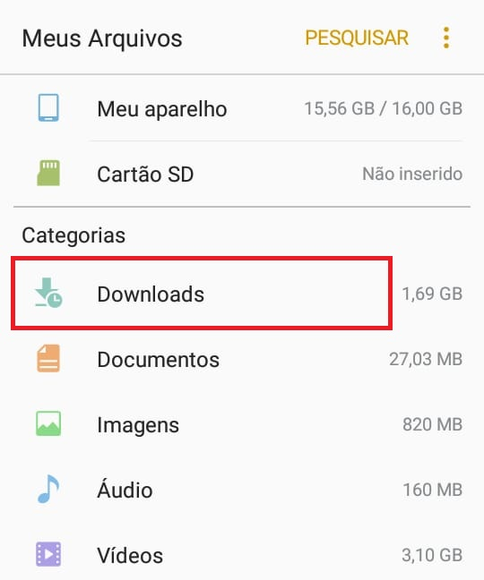
     
    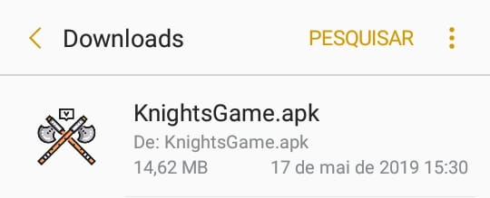

Você precisa dar permissão para instalação do APK, após finalizar, clique em **ABRIR** ou em **CONCLUÍDO**, como mostra os passos abaixo:

    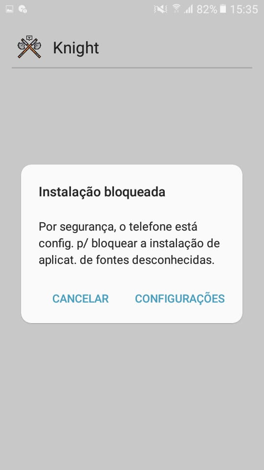
    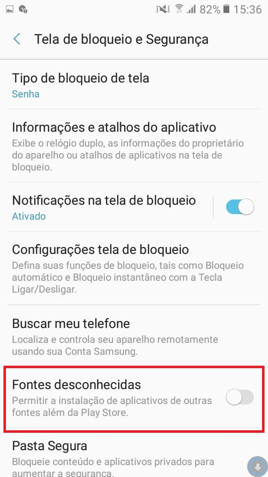
    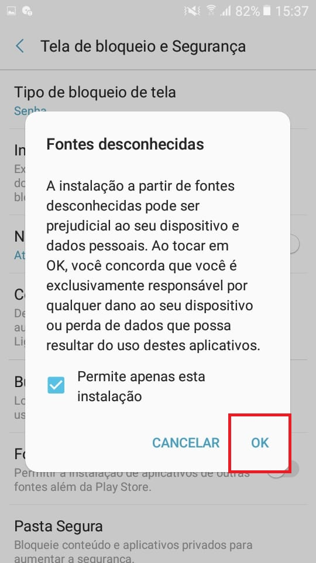
    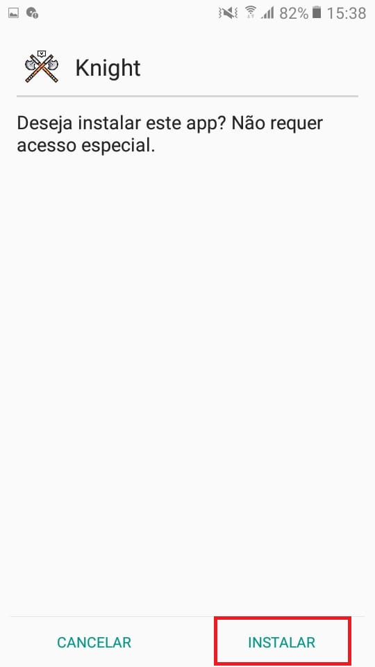 
    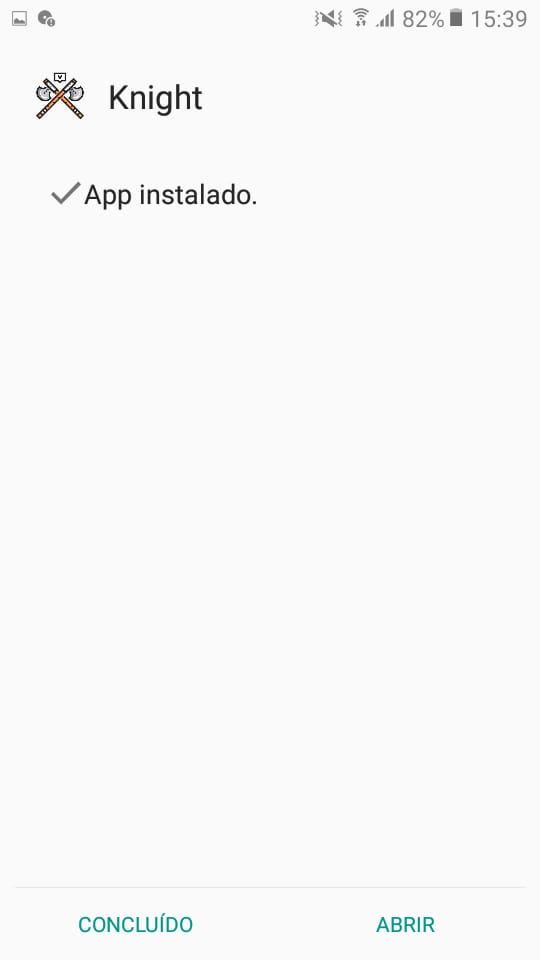
    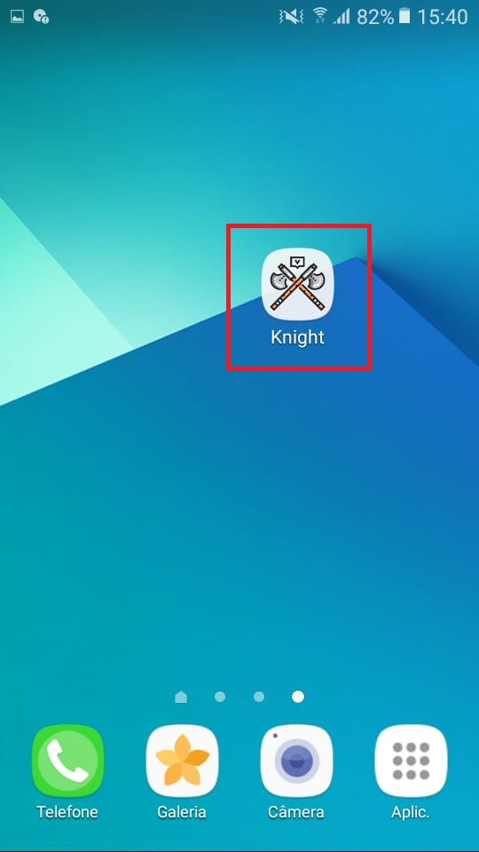

***Pronto, agora divirta-se*** 🎮

## Modificação
Para realizar modificações no Jogo, é necessário fazer o download do [Projeto .aia](/KnightsGame.aia) em sua maquina.

1. Faça seu login na plataforma do [MIT App Inventor](http://ai2.appinventor.mit.edu) com sua conta do google;

2. Importe o Projeto .aia nomeado como *KnightsGame.aia*;

    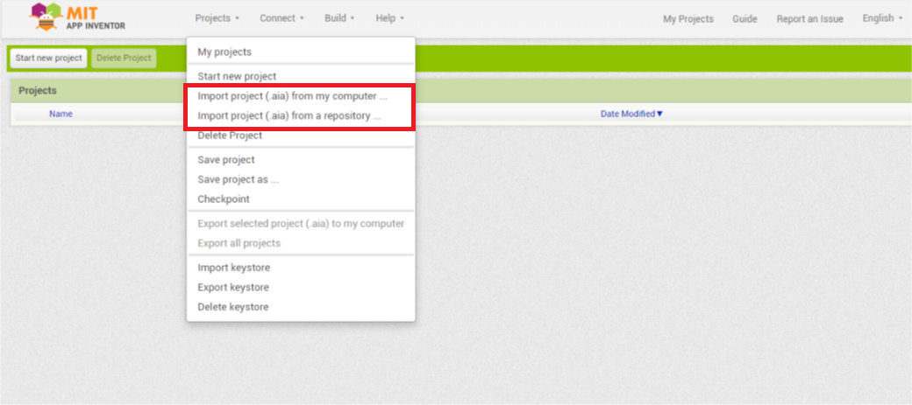
    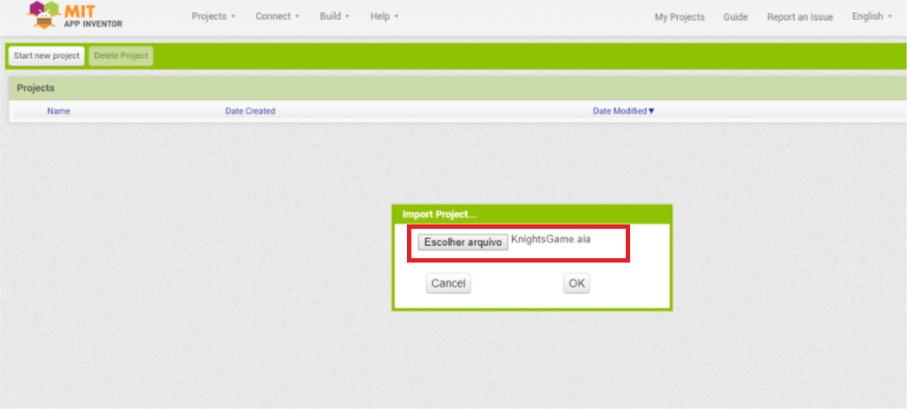

3. Abra o projeto e realize as modificações que deseja no Jogo em Designer ou Blocks;

    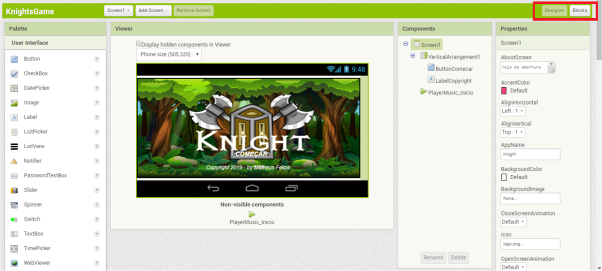

3. Pronto, agora você pode Gerar um APK para jogar ou um Exportar um Projeto .aia em sua maquina para outras pessoas visualizarem suas modificações.

> **OBS:** A plataforma **MIT App Inventor** com o domínio *ai2.appinventor.mit.edu* possui limitação de 10MB para geração de APK. Você pode gerar um *Projeto .aia* e exportar para a plataforma MIT App Inventor com domínio *code.appinventor.mit.edu* e seguir os mesmos passos acima ou realizar todo o processo direto nesse outro domínio.
