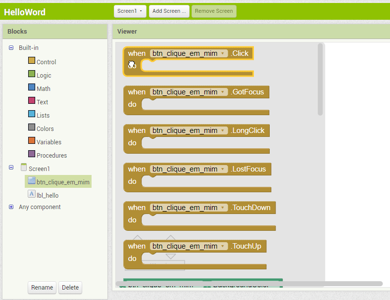

# Knight Game
> Um jogo android com movimentação de personagem, efeito parallax, efeitos sonoros e morte.

    

## O que é MIT App Inventor ?

    MIT App Inventor, também conhecido como App Inventor for Android, é uma aplicação de código aberto originalmente criada pela Google, e atualmente mantida pelo Massachusetts Institute of Technology (MIT).

   Ele permite que os recém-chegados à programação de computador criem aplicativos de software para o sistema operacional Android. Ele usa uma interface gráfica, muito semelhante ao do zero e da interface do usuário StarLogo TNG, que permite aos usuários arrastar e soltar objetos visuais para criar um aplicativo que pode ser executado em dispositivos Android.

    

**Fonte:** [Wikipédia](https://pt.wikipedia.org/wiki/App_Inventor)

